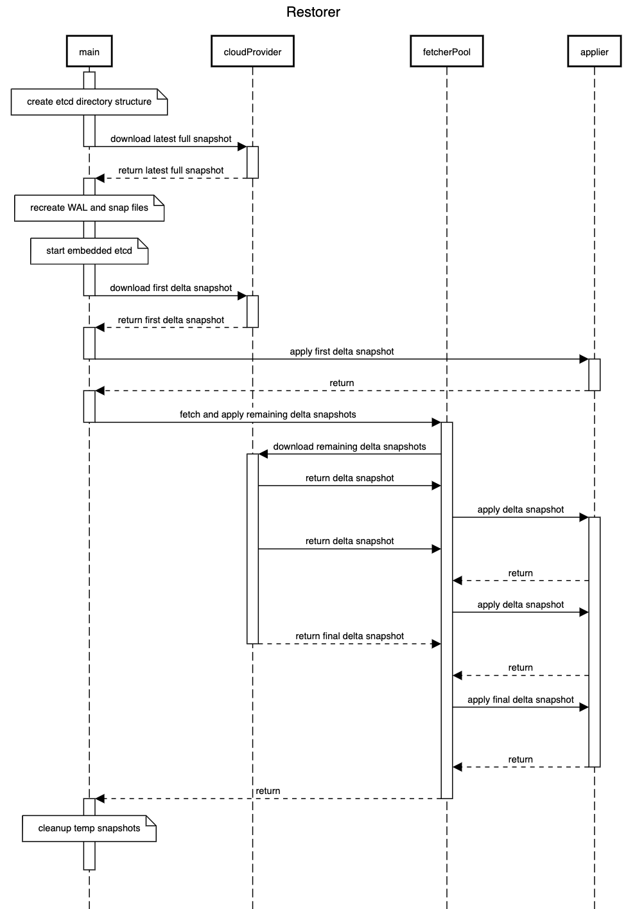

# Etcd data restoration

Etcd-backup-restore provides a simple and automated method of restoring single-node etcd clusters from their backups (snapshots) stored via the snapshotting process. Restoration kicks in when etcd data gets corrupted, either by the etcd process itself or due to PV corruption, or if the data is manipulated or erased due to human intervention. The restorer relies on the backups stored in an object storage bucket to restore the etcd data to its latest backed-up non-corrupt state.

In the context of etcd-backup-restore server, restoration is a conditional part of the initialization workflow, in which restoration is triggered when etcd data validation deems the data directory invalid or corrupt.

To learn about starting an etcd-backup-restore server, please follow the [getting started guide](../usage/getting_started.md).

## Assumption

- Data directory must not contain `member` directory before triggering restoration
- Snapshotter should NOT be running
  - This is taken care of by etcd-backup-restore when started in `server` mode
  - If running in `snapshot` mode, one must take precautions to stop the snapshotter before attempting to restore

## Requirements

- Etcd backup stored in an object storage bucket like AWS S3, GCP GCS, Azure ABS, Openstack Swift or Alicloud OSS
- The backup format must conform to that of etcd-backup-restore's snapshotter
  - Each backup must have a full snapshot, optionally followed by a set of delta/incremental snapshots

## Workflow

- Full snapshot is essentially the etcd DB file encapsulated in a JSON object
- The full snapshot is downloaded only if available. If not, the embedded etcd server takes care of initializing the DB file
- Delta snapshots are downloaded and applied only if available. If not, this step is skipped and restoration is marked as complete.

## Automatic restoration

Restoration is an essential part of etcd-backup-restore's `initialization` workflow, which is triggered as the first step in the `server` sub-command workflow. Ideally, operators need not worry about restoration when deploying etcd-backup-restore via the provided helm chart, where the tool is deployed in the `server` mode, as restoration will be triggered if the etcd data directory is found to be corrupt.

## Manual restoration

If for some reason, restoration is not triggered when it should have, or in the event that etcd-backup-restore is started in `snapshot` mode (which does not perform `initialization`), the operator can manually trigger restoration of data using the `restore` sub-command. However, it is recommended to use the `initialize` sub-command instead, because this performs the necessary validation checks on the data directory before taking the decision to perform a restoration.

Restorer fetches the latest full snapshot present in the snapstore, named `etcd-main/v1/Backup-xxxxxxxxxx/Full-aaaaaaaa-bbbbbbbb-xxxxxxxxxx`, and restores from it. It then fetches the subsequent delta snapshots and applies them sequentially on top of the partially restored data directory. These delta snapshots are named `etcd-main/v1/Backup-xxxxxxxxxx/Incr-bbbbbbbb-cccccccc-yyyyyyyyyy` and so on. Please consider the following while reading the aforementioned snapshot naming patterns: `xxxxxxxxxx`,`yyyyyyyyyy` are UTC timestamps and `aaaaaaaa`,`bbbbbbbb`,`cccccccc` are etcd revision numbers. Each snapshot contains etcd events between two revisions inclusive, as specified in the snapshot name.

:warning: If in doubt about the validity of the etcd data, operators must first visually confirm any inconsistency in revision numbers between the latest snapshot-set in the object store and the running etcd instance using the `etcdctl` tool before deciding to perform a manual restoration.

:warning: **Do not tamper with the object store in any way.** Data once lost from the object store, cannot be recovered. The object store is considered as the source of truth for the restorer.

:warning: If running the `snapshot` sub-command, it is necessary to stop this snapshotter process before triggering a restoration.

:warning: In order to successfully perform a restoration, the data directory must NOT contain the `member` directory, else the restoration will fail.
